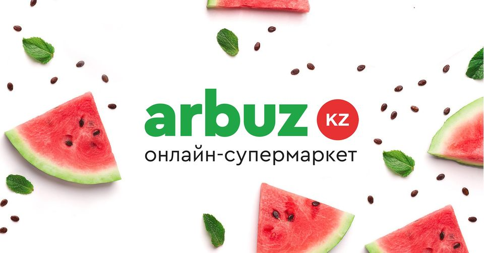
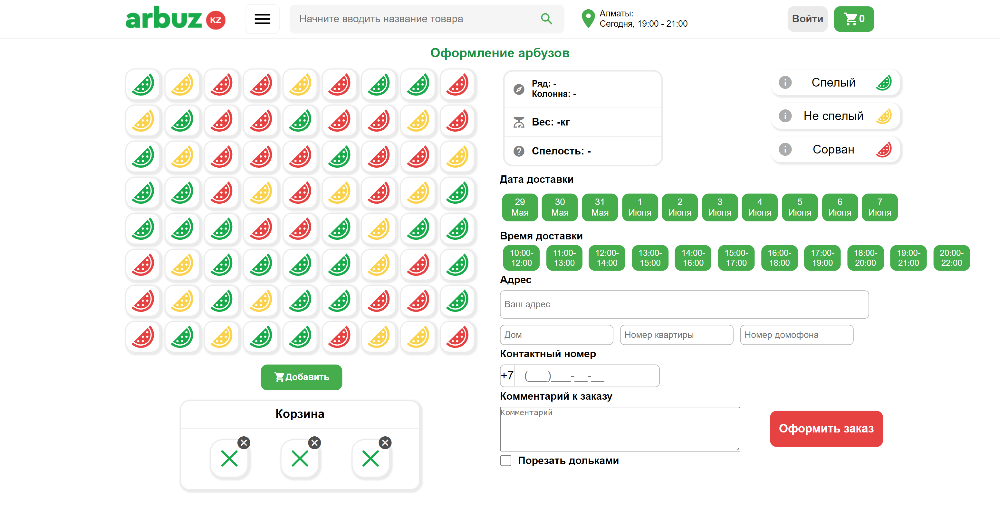
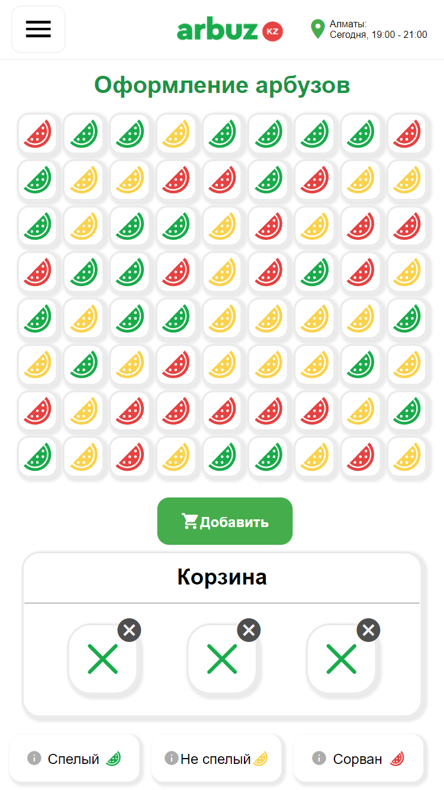
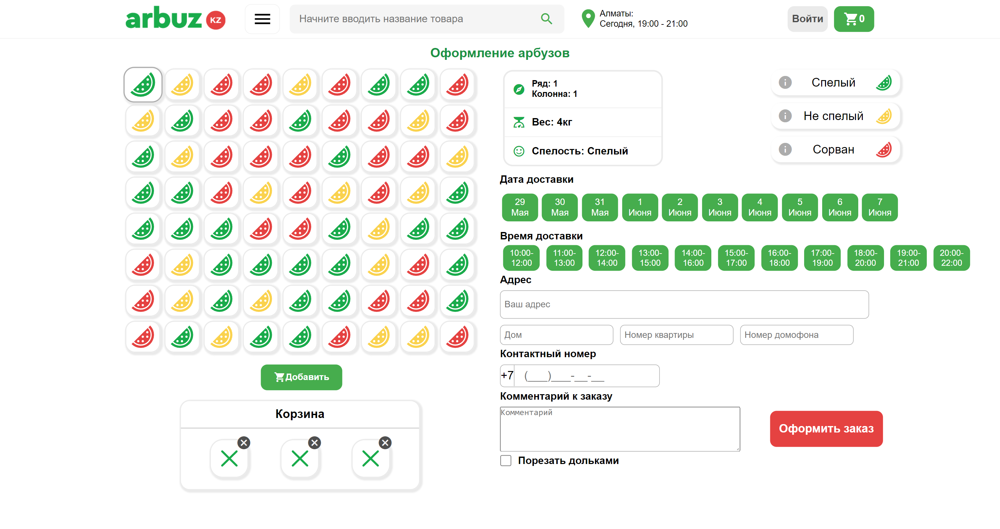
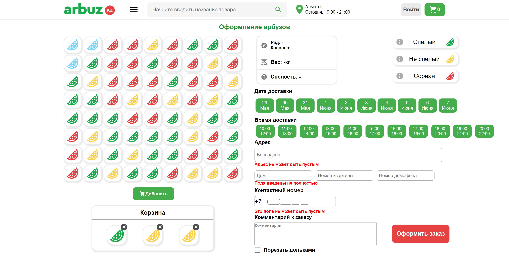
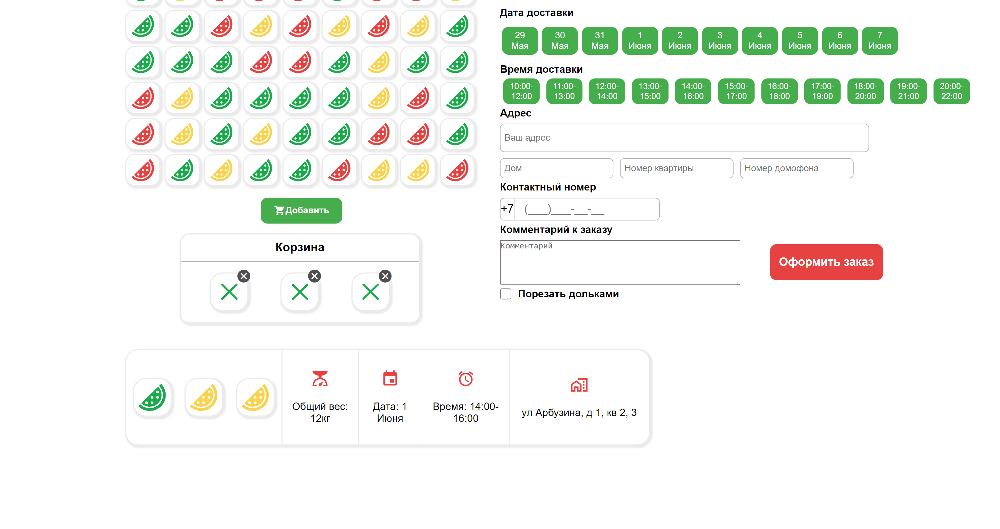
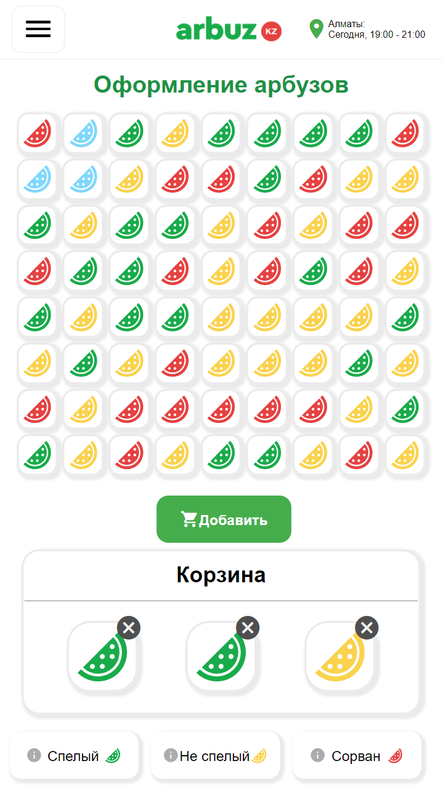
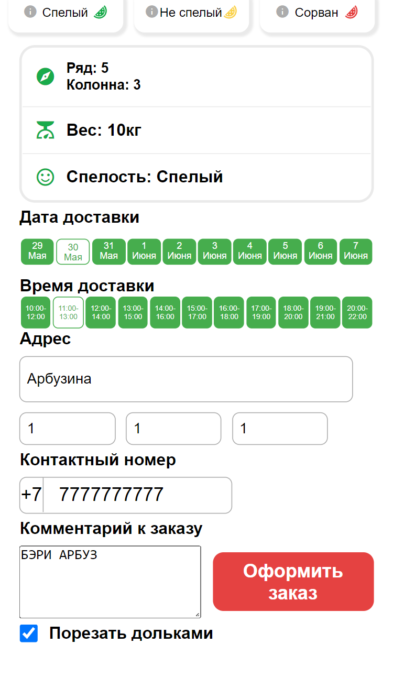
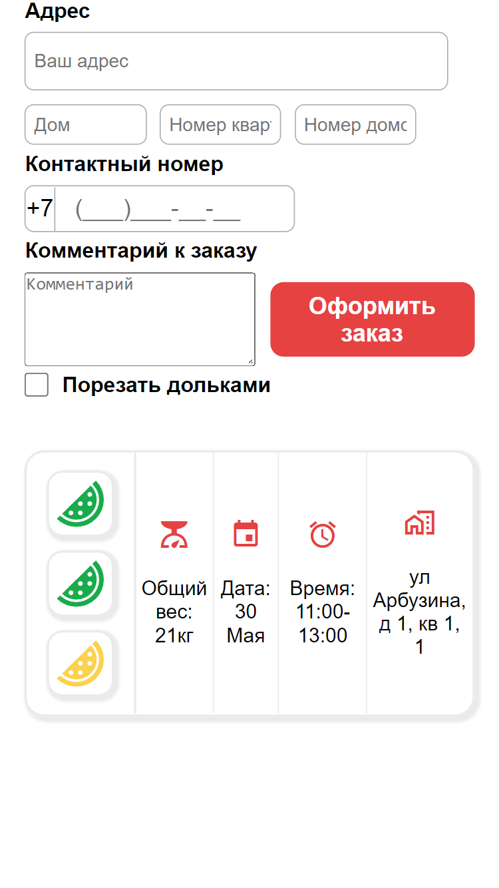

<div id="top"></div>
<div align="center">
<h3 align="center">Arbuz.kz Форма заказа</h3>
  <a href="https://github.com/Nura-21/Arbuz.kz-Order-Form">
    
  </a>

</div>
<!-- TABLE OF CONTENTS -->
<details>
  <summary>Table of Contents</summary>
  <ol>
    <li>
      <a href="#about-the-project">About The Project</a>
      <ul>
        <li><a href="#built-with">Built With</a></li>
      </ul>
    </li>
    <li>
      <a href="#getting-started">Getting Started</a>
      <ul>
        <li><a href="#prerequisites">Prerequisites</a></li>
        <li><a href="#installation">Installation</a></li>
      </ul>
    </li>
    <li><a href="#contributing">Contributing</a></li>
    <li><a href="#contact">Contact</a></li>
  </ol>
</details>

<!-- ABOUT THE PROJECT -->

## About The Project

<div align="center">
<h5>Home pages</h3>
  </img>
  </img>
</div>

<div align="center">
<h5>Full size</h3>
    <div align="center">
        
        
    </div>
    <div align="center">
        
        
    </div>
</div>

<div align="center" >
<h5>Mobile</h3>
    <div align="center">
        
        
        
    </div>
</div>
<br>

My internship test to Arbuz.kz.
I was very happy when they said that I should write to Vue. So I picked 3.x version of Vue. Since there is a very convenient COMPOSITION API. And I tried my best. One of the problems was that it wasn't allowed to use UI kits.

I didn’t implement the store, since I have one component, which I divided into small ones for modularity. The design was taken from the site of Arbuz.kz. The garden bed was presented in the form of a matrix(NxM(any)), in which data about watermelons are generated randomly. Cart with a maximum capacity of 3 watermelons. There are all possible validations and error prevention. The date and time are generated correctly with the user's local time. All date information in correct form, transition to the next month and year. At the very bottom of the screen, customer orders are displayed, and there may be several of them. There is an adaptation only for mobile devices.

As a result, I have generated a convenient and thoughtful object with information about the order, which in the future can be easily sent to the database.

<p align="right">(<a href="#top">back to top</a>)</p>

### Built With

In this project:

- [Vue](https://vuejs.org/)
- [SCSS, SASS](https://sass-lang.com/)
- [Material Icons](https://mui.com/material-ui/material-icons/)
- [Icon Sets](https://icon-sets.iconify.design/)

<p align="right">(<a href="#top">back to top</a>)</p>

<!-- GETTING STARTED -->

## Getting Started

To start this run this project you should have NodeJs(Vue). Then clone this repository.

### Prerequisites

- [NodeJS](https://nodejs.org/en/)

- npm

  ```sh
  npm install npm@latest -g
  ```

- Angular

  ```sh
  npm install -g @vue/cli
  ```

### Front

This project was generated with [Vue CLI](https://github.com/angular/angular-cli) version 3.x.

### Installation

_After installed prerequisites you can start and other libraries you can start running the project._

1. Clone the repo
   ```sh
   git clone https://github.com/Nura-21/Arbuz.kz-Order-Form.git
   ```
2. Run server.
   ```js
   npm run serve
   ```
    <p align="center">Enjoy <3 </p>

<p align="right">(<a href="#top">back to top</a>)</p>

<!-- CONTRIBUTING -->

## Contributing

1. Fork the Project
2. Create your Feature Branch (`git checkout -b feature/AmazingFeature`)
3. Commit your Changes (`git commit -m 'Add some AmazingFeature'`)
4. Push to the Branch (`git push origin feature/AmazingFeature`)
5. Open a Pull Request

<p align="right">(<a href="#top">back to top</a>)</p>

<!-- CONTACT -->

## Contact

Front-End - [Nura](https://www.instagram.com/trdln_/) - n_turdalin@kbtu.kz

Project Link: [Arbuz.kz-Order-Form](https://github.com/Nura-21/Arbuz.kz-Order-Form)

[![Nura][instan-shield]][in]
[![Nura][tn-shield]][tn]

<p align="right">(<a href="#top">back to top</a>)</p>

<!-- MARKDOWN LINKS & IMAGES -->
<!-- https://www.markdownguide.org/basic-syntax/#reference-style-links -->

[github-url]: https://github.com/Nura-21/Arbuz.kz-Order-Form
[insta-shield]: https://img.shields.io/badge/Instagram-4805c5?style=for-the-badge&logo=Instagram&logoColor=white
[tele-shield]: https://img.shields.io/badge/Telegram-4805c5?style=for-the-badge&logo=Telegram&logoColor=white
[instan-shield]: https://img.shields.io/badge/Nurassyl-000?style=for-the-badge&logo=Instagram&logoColor=white
[tn-shield]: https://img.shields.io/badge/Nurassyl-000?style=for-the-badge&logo=Telegram&logoColor=white
[tn]: https://t.me/trdln
[in]: https://www.instagram.com/trdln_/
